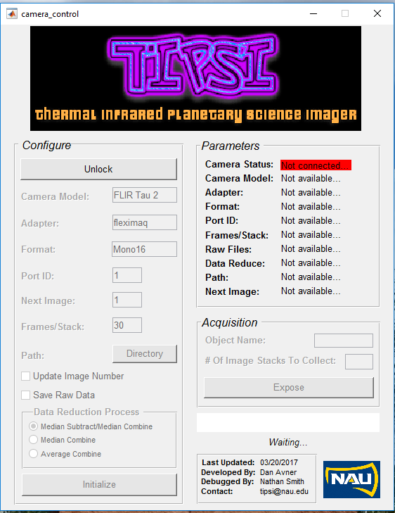

# 04/10/2017

This is the most up to date version of the MATLAB code for TIPSI GUI.

Overview:
camera_control.m
camera_control.fig 
tipsi.png
naulogo.png
uiwaitbar.m

The TIPSI GUI requires these files to run and operate. The main code process is in camera_control.m while the gui creation is in camera_control.fig. Please use MATLAB Guide to change the gui and do not mess with the hardcoding. 
